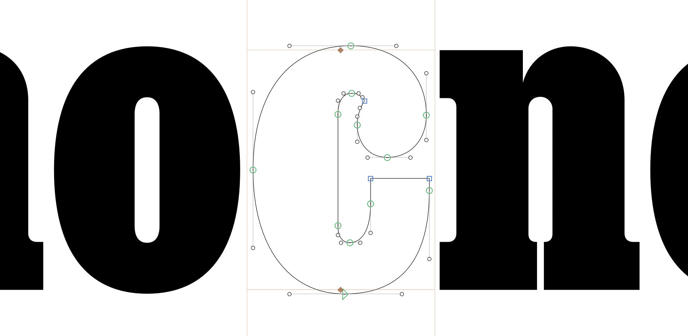

# Glyphs Cheatsheet

## Preview

**`Space bar`**: Show active glyph in Preview mode (just black and white)

**`T`**: Go into text mode, where you can type other glyphs

**`Contextual menu > Add Guide`**: Right click to add guideline; double-click guide point to change orientation, and use preferences to lock guide and ruler button to show measurements. 

  Font-wide guides like Cap Height and x-height can be set in `Font Info` (the ***`i`*** button) under `Masters`.

**Paths > Edit Background** or **`cmd`+`B`**: Every layer has a background where you can place items for reference. It is displayed with a light peach background.

## Components

**Contextual Menu > Decompose**: Convert selected component references into outlines

## Adding points

**Add points to existing path**: Use Pen Tool, click on path

**Convert straight segment to curve**: `Option + Click` on segment, handles will appear

**Toggle point smoothness**: `Double click` on a point to toggle smoothness. Green points are smooth; blue are unsmooth.

**Points on extremes**: `Paths > Add Extremes` will add points at the northmost, southmost, eastmost, and westmost parts of a curve.

With points on these extremes, most of your handles will be either totally vertical or totally horizontal, so you can constrain their movement with the `Shift` key.

**Contextual Menu > Open Corner**: Convert a point into two points with the contour overlapping itself. Helpful to change the contour in one dircetion but not the other.

## Deleting points

**Remove points**: Select points, `Delete`. If you remove one at a time, it will try to keep the curve as best it can.

**Delete segment and open path**: Select segment, `Option + Delete`

## Contour relationships

**`Paths > Remove Overlap`**: merge multiple contours into one

**`Paths > Reverse Contours`**: Toggle between additive and subtractive contours

## Spacing

Remember to **space as you draw**! Don’t wait to update sidebearings later. 

  Drawing within the context of control characters like `H`/`O` and `n`/`o` in a string like `HHXHOHOXOO` will help you consider how the shape affects color and rhythm. 

You can also use key commands to change spacing in text mode (`T`):

* `cmd`+`shift`+`←`/`→`: Adjust right sidebearing +/- 10 units
* `ctrl`+`shift`+`←`/`→`: Adjust left sidebearing +/- 10 units

